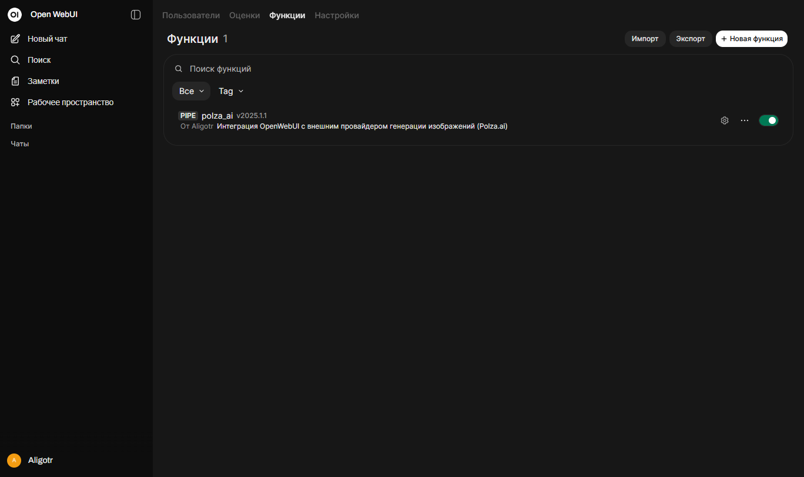
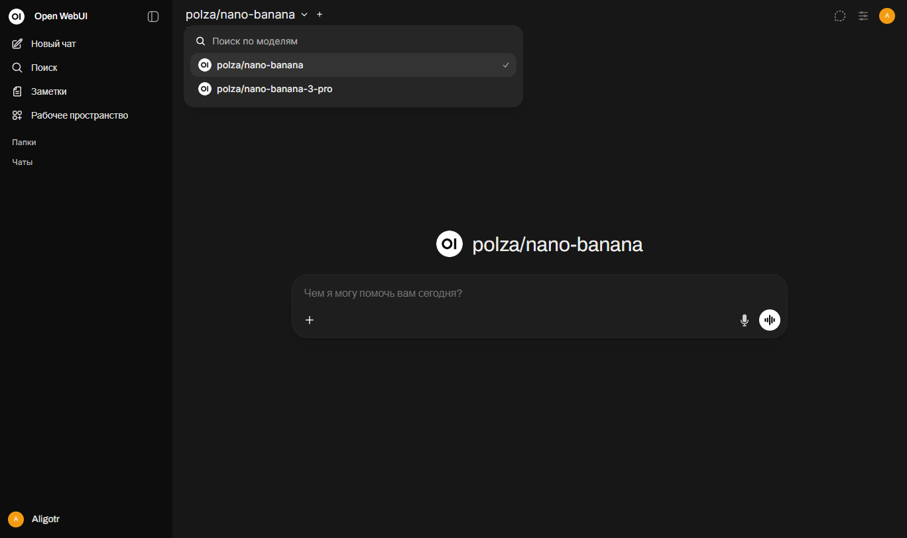

# Open WebUI - Function - Image Api

Функция реализует интеграцию OpenWebUI с внешним провайдером генерации изображений Polza.ai.  
Код предназначен для использования как pipe-функция в Open WebUI.  
Тесты производились на версии: **0.6.41**

## Возможности

- Делегирование генерации изображений в Polza.ai.
- Поддержка передачи изображений URL и Base64.
- Поддержка нескольких конфигураций моделей.
- Отправка статусов генерации в интерфейс OpenWebUI.

## Установка

Создайте новую функцию по следующему пути.  
Панель администратора - Функции - Новая функция.

## Использование

Плагин создаёт модели для работы с внешним api. Выберите нужную модель из выпадающего списка и с помощью вводного сообщения сделайте запрос на генерацию изображения.

